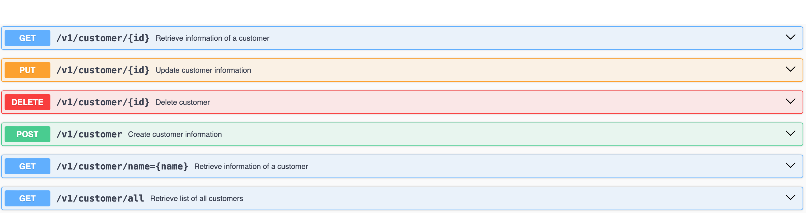

#   vet REST API 
vet REST API project exposes endpoints for a veterinary management system that you can manage customers and their animals, create vaccination records, manage veterinarians and their available dates to create and track appointments.

##  Technologies
    Java 21.0.2
    Spring Boot v3.2.5
    PostgreSQL v16
    swagger-core v3 (for api documentation)

## Entity Relations

## API Documentation
### Customer Management
Create, update, delete, list customers or search for customer by name:

### Animal Management
Create, update, delete, list animals or search by animal name or customer id:

### Vaccination Management
Create, update, delete, list vaccinations, filter vaccines by animal id, filter by protection date:

### Veterinarian Management
Create, update, delete, list veterinarians, manage veterinarian available dates:

### Available Date Management
Create, update, delete, list available dates:

### Appointment Management
Create appointments for animals if for an available veterinarian, update, delete, list appointments, filter appointments by animals or veterinarians on a certain date range: 

