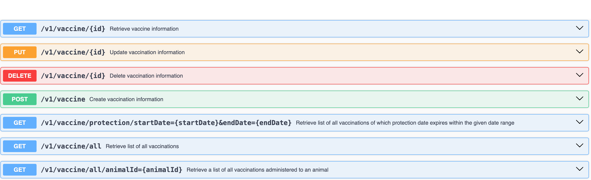
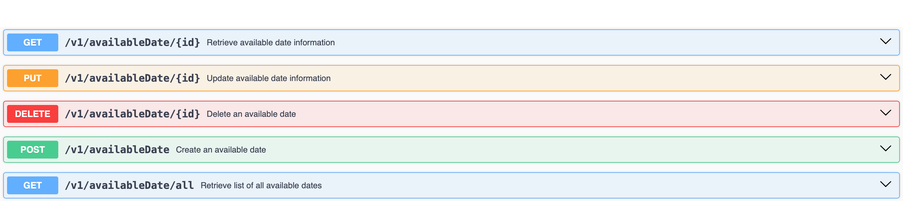

#   vet REST API 
vet REST API project exposes endpoints for a veterinary management system that you can manage customers and their animals, create vaccination records, manage veterinarians and their available dates to create and track appointments.

##  Technologies
    Java 21.0.2
    Spring Boot v3.2.5
    PostgreSQL v16
    swagger-core v3 (for api documentation)

## Entity Relations

## API Documentation

